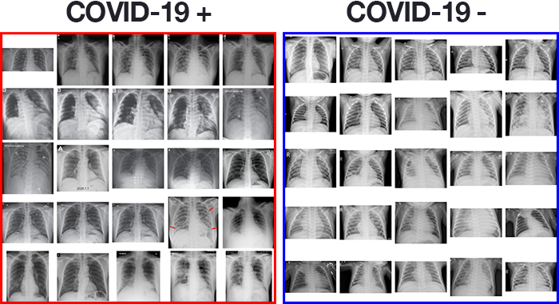
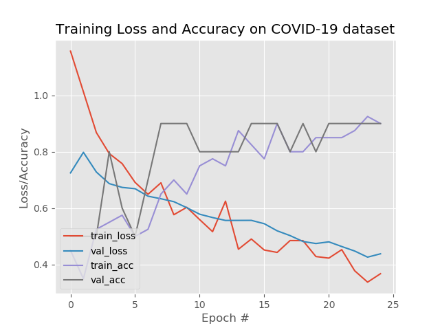

I use Keras, TensorFlow, and Deep Learning to train an automatic COVID-19 detector on a dataset of X-ray images.
High quality, peer reviewed image datasets for COVID-19 don’t exist (yet), so I had to work with what I found on the internet, namely on pyimagesearch web and there from Joseph Cohen’s GitHub repo of open-source X-ray images:

They sampled 25 images from Cohen’s dataset, taking only the posterioranterior (PA) view of COVID-19 positive cases.
Then sampled 25 images of healthy patients using Kaggle’s Chest X-Ray Images (Pneumonia) dataset

### This is how it looks like:
On the left side - positive patients for COVID-19 and on the right side - negative patients for COVID-19.
These images are used to train a deep learning model with TensorFlow and Keras to automatically predict 
whether a patient has COVID-19 (i.e., coronavirus)

## RESULT

I am obtaining 80% sensitivity and 100% specificity implying that:
- Of patients that do have COVID-19 (i.e., true positives), I could accurately identify them as “COVID-19 positive” 80% of the time using my model.
- Of patients that do not have COVID-19 (i.e., true negatives), we could accurately identify them as “COVID-19 negative” on 100% of the time using my model.

As my training history plot shows, my network is not overfitting, despite having very limited training data:

These results are gathered for educational purposes only, not for medical or any other. I dont have enough reliable data
to train COVID-19 detector which can be used for medical purposes. But this is nice example
of using data to help doctors decide faster and maybe even save lives.

