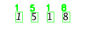
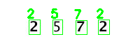
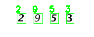
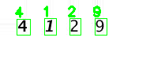

### OWM DATASET + CNN - LeNet

I created my my own custom dataset, which consist of a number (actually 4 numbers in one number “1234”)  and then training a CNN, which recognize each digit. I also had to use OpenCV library, which help me to define digits. This is series of steps I made:
1. Downloading a set of images
2. Labeling and annotating images for training 
3. Training a CNN on my custom dataset
4. Evaluating and testing the trained CNN

After only 15 epochs LeNet network is obtaining 100% classification accuracy on both the training and validation sets.
Here are results:

