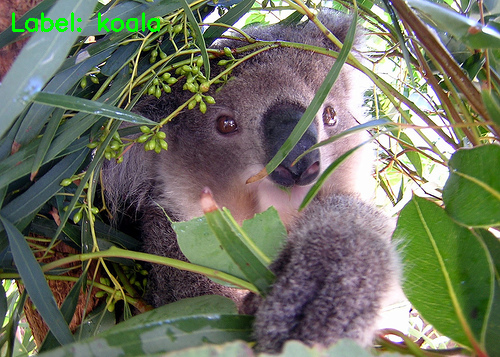
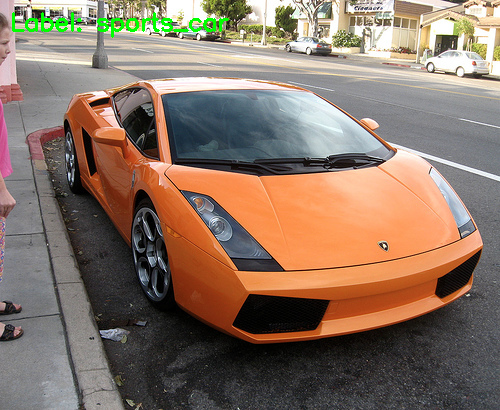
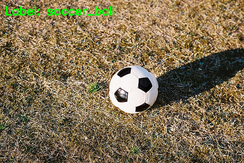
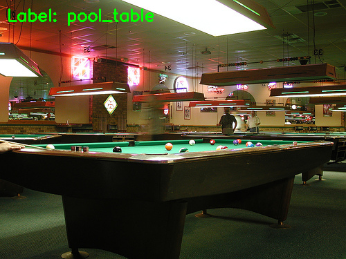

# PRE-TRAINED CNNs

## VGG
- using only 3x3 conv.layer filers
- painfully slow to train
- network weights are large (VGG16 - 533MB)

## ResNet
- demonstrating that extremely deep networks can be triened using standerd SGD
- much deeper than VGG16 or VGG19
- using global average pooling => model size is smaller (102MB) for ResNet50 (50 - weight layers)

## InceptionV3
- goal is to act as a multi-level feature extractor by computing 1x1, 3x3, 5x5 convolutions
=> output of these filters are then stacked along the channel dimension before being fed into next layer in the network
- from Google
- size of model/weights - 96MB

## Xception
- extension of Inception which replaces the standard Inception modules with depth wise separable convolutions
- size 91MB

Here are examples of image classification by VGG16:
### Koala
1. koala: 99.99%
2. fox_squirrel: 0.01%
3. indri: 0.00%
4. Madagascar_cat: 0.00%
5. wallaby: 0.00%

### Sports_car
1. sports_car: 65.57%
2. convertible: 10.63%
3. cab: 5.72%
4. car_wheel: 5.39%
5. limousine: 2.42%

### Soccer_ball
1. soccer_ball: 99.51%
2. golf_ball: 0.22%
3. teddy: 0.06%
4. football_helmet: 0.03%
5. toilet_tissue: 0.02%

