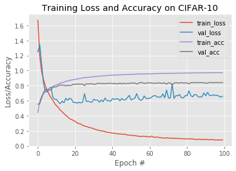

# UNDERFITTING and OVERFITTING

Picture displays loss and accuracy plot after 100 epochs

EPOCH 5:
- Right now still in the “underfitting zone”. Network is clearly learning from the training data as you can see loss decreasing and accuracy increasing; however, we have not reached any plateaus. 

EPOCH 10:
- after epoch 10 we can notice signs of overfitting, but nothing that is overly alarming. The training loss is starting to diverge from the validation loss, but some divergence is entirely normal, and even a good indication that our network is continuing to learn underlying patterns from the training data. 

EPOCH 25:
- However, by epoch 25 we have reached the “overfitting zone”. Training loss is continuing to decline while validation loss has stagnated. This is a clear first sign of overfitting and bad things to come. 

EPOCH 50:
- By epoch 50 we are clearly in trouble. Validation loss is starting to increase, the tell-tale sign of overfitting. At this point, you should have definitely stopped the experiment to reassess your parameters. 
- If we were to let the network train until epoch 100, the overfitting would only get worse. The gap between training loss and validation loss is gigantic, all while validation loss continues to increase. While the validation accuracy of this network is above 80%, the ability of this model to generalize would be quite poor. Based on these plots we can clearly see when and where overfitting starts to occur. 

Finally, when you start to think there are signs of overfitting, don’t become too trigger happy to kill off the experiment. Let the network train for another 10-15 epochs to ensure your hunch is correct and that overfitting is occurring – we often need the context of these epochs to help us make this final decision. 

