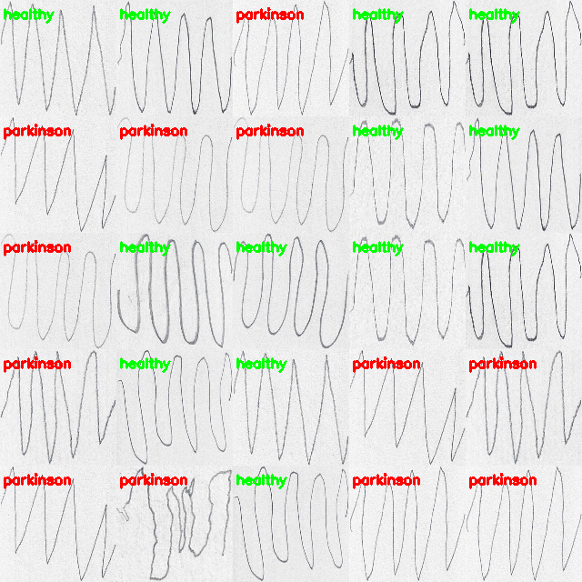

# Parkinson desease
## AI/ML IN MEDICINE 👨‍⚕️🩺

For the last weeks, I've been learning to code an artificial intelligence programs. I want to show you one interesting and practical project. This is the field of medicine, namely Parkinson's disease.

Parkinson's disease is a long-term and progressive brain disease that most commonly affects people over 60 years of age. People with Parkinson's disease have difficulty controlling body movements and the patient gradually loses the ability to perform daily tasks.

Currently, Parkinson's disease cannot be cured, but after diagnosis, symptoms of the disease can be effectively alleviated. One method of diagnosis is the so-called geometric test (2017), in which the patient draws spirals or waves. Based on such a test, the doctor can determine whether or not the patient has Parkinson's disease.

So that the doctor does not have to compare each drawn picture with a picture drawn by a healthy person, it can be automated by computer. 

My program can tell with approximately 83% accuracy whether a patient is healthy or ill.
This is how the result looks on several test images (images in the status).

This is just a small example of how artificial intelligence can help people to be more efficient, faster and make better decisions.

#MachineLearning #AI #ML #medicine

