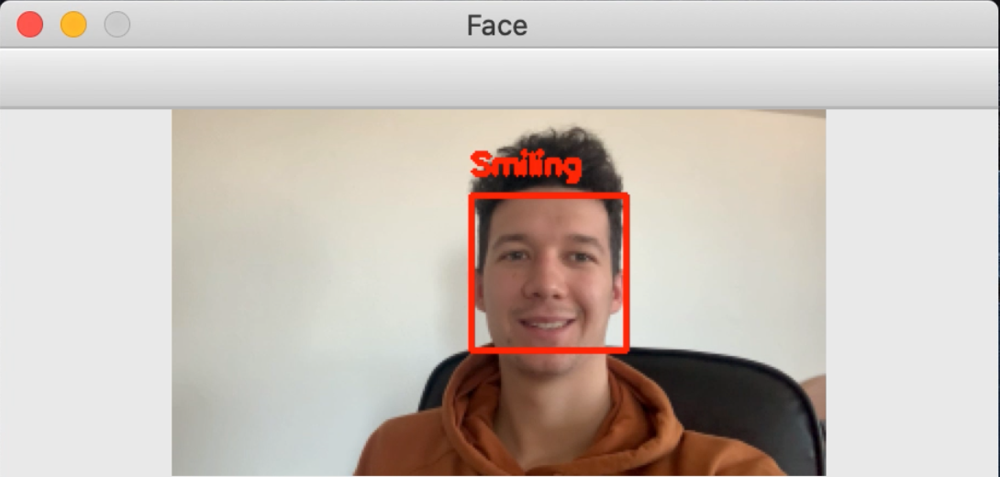
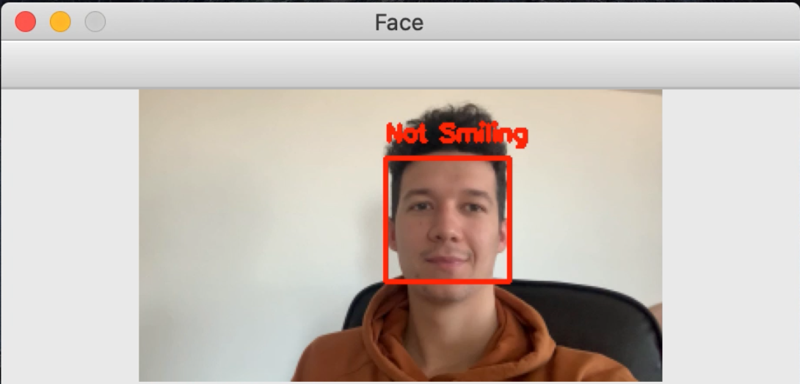

# SMILE DETECTION

I used LeNet CNN to train and then recognize, if I am smiling or not.

For training the CNN I used SMILES dataset. After training LeNet had 93% classification accuracy. 
Higher classification accuracy can be obtained by gathering more training data or applying data augmentation to existing training data.

Then I created a Python script to read frames from a webcam/video file, detect faces, and then apply my pre-trained network. In order to detect faces, I used OpenCV’s Haar cascades. Once a face was detected it was extracted from the frame and then passed through LeNet to determine if I was smiling or not smiling. 

# RESULTS
## smiling

## not smiling

